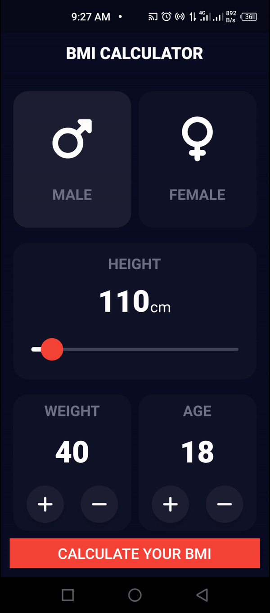

<a name="readme-top"></a>

<!-- TABLE OF CONTENTS -->

# 📗 Table of Contents

- [📖 About the Project](#about-project)
    - [🛠 Built With](#built-with)
        - [Key Features](#key-features)
    - [🚀 Live Demo](#live-demo)
- [💻 Getting Started](#getting-started)
    - [Setup](#setup)
    - [Prerequisites](#prerequisites)
    - [Usage](#usage)
- [👥 Authors](#authors)
- [🤝 Contributing](#contributing)
- [⭐️ Show your support](#support)
- [🙏 Acknowledgements](#acknowledgements)
- [📝 License](#license)

<!-- PROJECT DESCRIPTION -->

# 📖 BMI Calculator <a name="about-project"></a>

**BMI Calculator** is designed using the BLoC state management principles. It calculates your body mass index and give advice on the next line of action.


## 🛠 Built With <a name="built-with"></a>

This project was built using Flutter framework and dart programming language.


<!-- Features -->

### Key Features <a name="key-features"></a>

- **Calculating BMI**
- **Show range of BMI for a particular health state**
- **Give advice based on your current BMI**

<p align="right">(<a href="#readme-top">back to top</a>)</p>

<!-- LIVE DEMO -->

## 🚀 Live Demo <a name="live-demo"></a>

<div style="text-align: center;">
  
</div>

<p align="right">(<a href="#readme-top">back to top</a>)</p>

<!-- GETTING STARTED -->

## 💻 Getting Started <a name="getting-started"></a>

To get a local copy up and running, follow these steps.

### Prerequisites

In order to run this project you need:
- A personal computer connected to the internet
- Have a local version control like git installed on your computer and a Github account.
- Install flutter on your machine: [Flutter Installation Guide](https://docs.flutter.dev/get-started/install)
- Setup your code editor (Visual Studio Code, Android Studio) :  [Editor Setup](https://docs.flutter.dev/get-started/editor)
- Run `flutter doctor` to confirm everything is setup properly.


### Setup

Clone this repository to your desired folder:

```sh
git clone https://github.com/henry-dura/BMI-Calculator.git
```
```sh
cd BMI-Calculator
```


### Usage

To run the project, execute the following command:

```sh
flutter run
```

<p align="right">(<a href="#readme-top">back to top</a>)</p>

<!-- AUTHORS -->

## 👥 Author <a name="authors"></a>

👤 **Henry Ikemefuna Ugwu**

- GitHub: [View Github Page](https://github.com/henry-dura)
- Twitter: [View Twitter Page](https://twitter.com/henryikemefuna)
- LinkedIn: [View LinkedIn Page](https://www.linkedin.com/in/henry-ikemefuna-ugwu-3a2613100/)


<p align="right">(<a href="#readme-top">back to top</a>)</p>


<!-- CONTRIBUTING -->

## 🤝 Contributing <a name="contributing"></a>

Contributions, issues, and feature requests are welcome!

Feel free to check the [issues page](https://github.com/henry-dura/BMI-Calculator/issues).

<p align="right">(<a href="#readme-top">back to top</a>)</p>

<!-- SUPPORT -->

## ⭐️ Show your support <a name="support"></a>

If you like this project and want to show your support, please give it a ⭐️!

<p align="right">(<a href="#readme-top">back to top</a>)</p>

## Acknowledgments

A list of resources that I find helpful and would like to give credit to :

- [Ruben Vaalt ](https://dribbble.com/shots/4585382-Simple-BMI-Calculator/attachments/4585382?mode=media)
- [GitHub ](https://www.github.com)
- [Youtube ](https://www.youtube.com)


<!-- LICENSE -->

## 📝 License <a name="license"></a>

This project is MIT [MIT](./MIT.md) licensed.

<p align="right">(<a href="#readme-top">back to top</a>)</p>